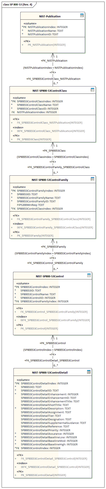
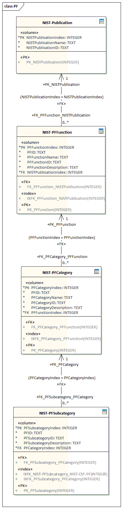

# NIST Crosswalks

Several of the NIST risk, security and privacy publications lend themselves *- pretty well -* to a relational data model.
So, to have more flexibility than the PDFs and xlsx NIST puts out, I laid them out *- with some interpretation, mind you -* and imported them.

The single NIST-Crosswalk.db is stand alone SQLite DB and contains everything.  

The SQL DDL and the original data (in CSV format, located in the corresponding folders) is included, which also includes various views.

## Cybersecurity Framework (CSF) to Security and Privacy Controls (SP 800-53 Rev. 4) to Risk Management Framework (RMF) to Privacy Framework (PF) Crosswalk

## Cybersecurity Framework (CSF) to Security and Privacy Controls (SP 800-53 Rev. 4) Crosswalk

## Cybersecurity Framework (CSF) to Risk Management Framework (RMF) Crosswalk

## Cybersecurity Framework (CSF) to Privacy Framework (PF) Crosswalk

## Cybersecurity Framework (CSF)

## Security and Privacy Controls SP 800-53 (Rev. 4)

## Risk Management Framework (RMF)

## Privacy Framework (PF)

